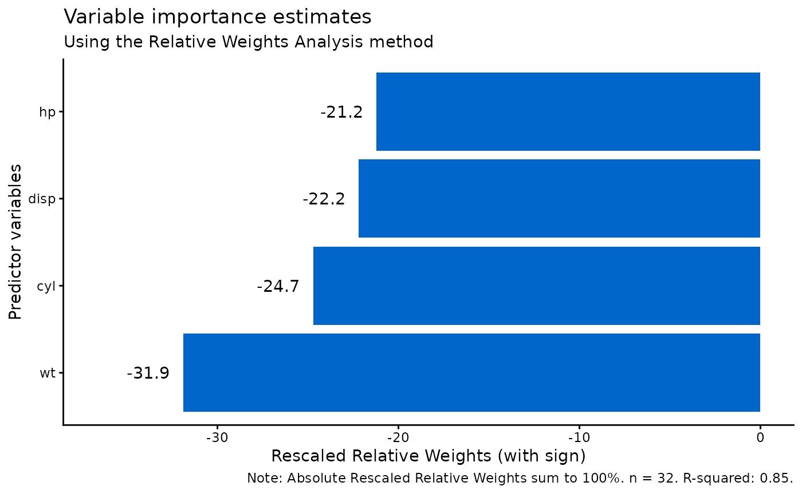
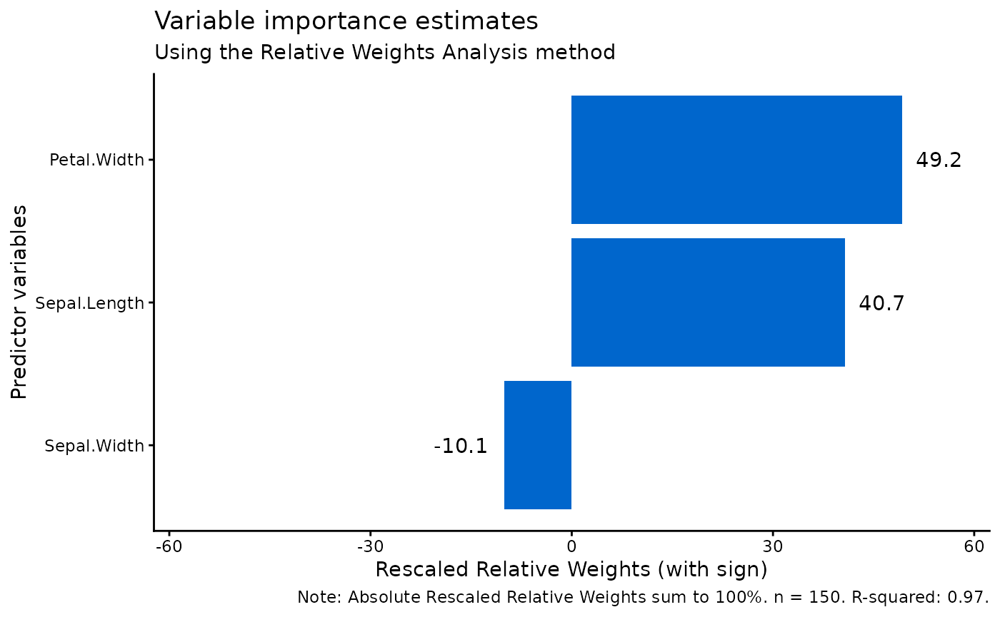

# Regression Methods: Multiple and Logistic RWA

``` r
library(rwa)
library(dplyr)
library(ggplot2)
```

## Introduction

The `rwa` package provides two specialized functions for conducting
Relative Weights Analysis depending on the nature of your outcome
variable:

- **[`rwa_multiregress()`](https://martinctc.github.io/rwa/reference/rwa_multiregress.md)**:
  For continuous outcome variables (standard multiple regression)
- **[`rwa_logit()`](https://martinctc.github.io/rwa/reference/rwa_logit.md)**:
  For binary outcome variables (logistic regression)

The main [`rwa()`](https://martinctc.github.io/rwa/reference/rwa.md)
function acts as a convenient wrapper that can automatically detect
which method to use, but understanding these underlying functions gives
you more control and insight into your analysis.

## When to Use Each Method

| Outcome Type | Function                                                                              | Example Use Cases                                  |
|--------------|---------------------------------------------------------------------------------------|----------------------------------------------------|
| Continuous   | [`rwa_multiregress()`](https://martinctc.github.io/rwa/reference/rwa_multiregress.md) | Predicting prices, scores, measurements            |
| Binary (0/1) | [`rwa_logit()`](https://martinctc.github.io/rwa/reference/rwa_logit.md)               | Predicting yes/no, pass/fail, purchase/no purchase |

## Multiple Regression with `rwa_multiregress()`

### Basic Example with mtcars

The `mtcars` dataset contains continuous variables ideal for
demonstrating multiple regression RWA. Let’s examine what factors most
influence fuel efficiency (mpg):

``` r
# Direct use of rwa_multiregress()
result_multi <- rwa_multiregress(
  df = mtcars,
  outcome = "mpg",
  predictors = c("cyl", "disp", "hp", "wt")
)

# View results
result_multi$result
#>   Variables Raw.RelWeight Rescaled.RelWeight Sign
#> 1       cyl     0.2096904           24.70914    -
#> 2      disp     0.1883043           22.18908    -
#> 3        hp     0.1799590           21.20570    -
#> 4        wt     0.2706812           31.89607    -
```

### Interpreting Multiple Regression Results

The output contains several key pieces of information:

``` r
# R-squared: Total variance explained
cat("R-squared:", round(result_multi$rsquare, 4), "\n")
#> R-squared: 0.8486
cat("This means", round(result_multi$rsquare * 100, 1), 
    "% of variance in mpg is explained by these predictors.\n\n")
#> This means 84.9 % of variance in mpg is explained by these predictors.

# Number of observations
cat("Sample size:", result_multi$n, "\n\n")
#> Sample size: 32

# Relative importance breakdown
cat("Relative Importance (Rescaled Weights sum to 100%):\n")
#> Relative Importance (Rescaled Weights sum to 100%):
result_multi$result %>%
  arrange(desc(Rescaled.RelWeight)) %>%
  mutate(Rescaled.RelWeight = round(Rescaled.RelWeight, 2)) %>%
  select(Variables, Rescaled.RelWeight)
#>   Variables Rescaled.RelWeight
#> 1        wt              31.90
#> 2       cyl              24.71
#> 3      disp              22.19
#> 4        hp              21.21
```

The **Rescaled.RelWeight** column shows the percentage of explainable
variance attributed to each predictor. In this example, we can see that
weight (`wt`) is the most important predictor of fuel efficiency,
followed by displacement (`disp`).

### Using the `applysigns` Parameter

By default, relative weights are always positive (they represent
variance contributions). Use `applysigns = TRUE` to see the direction of
each relationship:

``` r
# With sign information
result_signed <- rwa_multiregress(
  df = mtcars,
  outcome = "mpg",
  predictors = c("cyl", "disp", "hp", "wt"),
  applysigns = TRUE
)

result_signed$result %>%
  select(Variables, Raw.RelWeight, Sign.Rescaled.RelWeight, Sign)
#>   Variables Raw.RelWeight Sign.Rescaled.RelWeight Sign
#> 1       cyl     0.2096904               -24.70914    -
#> 2      disp     0.1883043               -22.18908    -
#> 3        hp     0.1799590               -21.20570    -
#> 4        wt     0.2706812               -31.89607    -
```

The `Sign` column indicates whether each predictor has a positive (+) or
negative (-) relationship with the outcome. Negative signs for `cyl`,
`disp`, `hp`, and `wt` make intuitive sense: more cylinders, larger
displacement, more horsepower, and heavier weight all tend to decrease
fuel efficiency.

### Examining Correlation Structures

The function also returns the correlation matrices, which can help
understand relationships between predictors:

``` r
# Correlation between predictors
cat("Predictor Correlation Matrix (RXX):\n")
#> Predictor Correlation Matrix (RXX):
round(result_multi$RXX, 3)
#>        cyl  disp    hp    wt
#> cyl  1.000 0.902 0.832 0.782
#> disp 0.902 1.000 0.791 0.888
#> hp   0.832 0.791 1.000 0.659
#> wt   0.782 0.888 0.659 1.000

# Correlation of predictors with outcome
cat("\nPredictor-Outcome Correlations (RXY):\n")
#> 
#> Predictor-Outcome Correlations (RXY):
round(result_multi$RXY, 3)
#>    cyl   disp     hp     wt 
#> -0.852 -0.848 -0.776 -0.868
```

## Logistic Regression with `rwa_logit()`

### Creating a Binary Outcome

For logistic regression, we need a binary outcome variable. Let’s create
one from the `mtcars` dataset:

``` r
# Create binary outcome: high efficiency (1) vs low efficiency (0)
mtcars_binary <- mtcars %>%
  mutate(high_mpg = ifelse(mpg > median(mpg), 1, 0))

# Check distribution
table(mtcars_binary$high_mpg)
#> 
#>  0  1 
#> 17 15
```

### Basic Logistic RWA

``` r
# Logistic regression RWA
result_logit <- rwa_logit(
  df = mtcars_binary,
  outcome = "high_mpg",
  predictors = c("cyl", "disp", "hp", "wt")
)

# View results
result_logit$result
#>   Variables Raw.RelWeight Rescaled.RelWeight Sign
#> 1       cyl      7.296847           22.22380    -
#> 2      disp      7.343709           22.36653    -
#> 3        hp      4.937049           15.03663    -
#> 4        wt     13.255876           40.37304    -
```

### Interpreting Logistic RWA Results

The interpretation differs slightly from multiple regression:

``` r
# Lambda (analogous to R-squared for logistic regression)
cat("Lambda (pseudo R-squared):", round(result_logit$lambda, 4), "\n")
#> Lambda (pseudo R-squared): 0.7481 0.4305 0.3884 0.3227 0.4305 0.7102 0.3386 0.4423 0.3884 0.3386 0.8239 0.2358 0.3227 0.4423 0.2358 0.8029
cat("Sample size:", result_logit$n, "\n\n")
#> Sample size: 32

# Relative importance
cat("Relative Importance for Predicting High Fuel Efficiency:\n")
#> Relative Importance for Predicting High Fuel Efficiency:
result_logit$result %>%
  arrange(desc(Rescaled.RelWeight)) %>%
  mutate(Rescaled.RelWeight = round(Rescaled.RelWeight, 2))
#>   Variables Raw.RelWeight Rescaled.RelWeight Sign
#> 1        wt     13.255876              40.37    -
#> 2      disp      7.343709              22.37    -
#> 3       cyl      7.296847              22.22    -
#> 4        hp      4.937049              15.04    -
```

Like multiple regression, the **Rescaled.RelWeight** values sum to 100%,
representing the percentage of predictable variance attributed to each
predictor.

### Logistic RWA with Signs

``` r
# With direction information
result_logit_signed <- rwa_logit(
  df = mtcars_binary,
  outcome = "high_mpg",
  predictors = c("cyl", "disp", "hp", "wt"),
  applysigns = TRUE
)

result_logit_signed$result %>%
  select(Variables, Rescaled.RelWeight, Sign)
#>   Variables Rescaled.RelWeight Sign
#> 1       cyl           22.22380    -
#> 2      disp           22.36653    -
#> 3        hp           15.03663    -
#> 4        wt           40.37304    -
```

## Using the `rwa()` Wrapper Function

The main [`rwa()`](https://martinctc.github.io/rwa/reference/rwa.md)
function provides a convenient interface that can automatically detect
whether to use multiple or logistic regression based on your outcome
variable.

### Auto-Detection of Binary Outcomes

``` r
# For continuous outcome - automatically uses multiple regression
result_auto_multi <- rwa(
  df = mtcars,
  outcome = "mpg",
  predictors = c("cyl", "disp", "hp", "wt")
)

# For binary outcome - automatically uses logistic regression
result_auto_logit <- rwa(
  df = mtcars_binary,
  outcome = "high_mpg",
  predictors = c("cyl", "disp", "hp", "wt")
)
```

### Explicit Method Selection

You can also explicitly specify the method using the `method` parameter:

``` r
# Force multiple regression
result_explicit_multi <- rwa(
  df = mtcars,
  outcome = "mpg",
  predictors = c("cyl", "disp", "hp", "wt"),
  method = "multiple"
)

# Force logistic regression (requires binary outcome)
result_explicit_logit <- rwa(
  df = mtcars_binary,
  outcome = "high_mpg",
  predictors = c("cyl", "disp", "hp", "wt"),
  method = "logistic"
)
```

### Additional Features in `rwa()`

The wrapper function also provides sorting and visualization options:

``` r
# Sort results by importance
result_sorted <- rwa(
  df = mtcars,
  outcome = "mpg",
  predictors = c("cyl", "disp", "hp", "wt"),
  sort = TRUE
)

result_sorted$result
#>   Variables Raw.RelWeight Rescaled.RelWeight Sign
#> 1        wt     0.2706812           31.89607    -
#> 2       cyl     0.2096904           24.70914    -
#> 3      disp     0.1883043           22.18908    -
#> 4        hp     0.1799590           21.20570    -

# Visualize with plot_rwa()
plot_rwa(result_sorted)
```



## Real-World Example: Iris Dataset

Let’s apply these methods to the classic `iris` dataset.

### Multiple Regression: Predicting Petal Length

``` r
# Predict petal length from other measurements
iris_result <- rwa_multiregress(
  df = iris,
  outcome = "Petal.Length",
  predictors = c("Sepal.Length", "Sepal.Width", "Petal.Width"),
  applysigns = TRUE
)

cat("R-squared:", round(iris_result$rsquare, 4), "\n\n")
#> R-squared: 0.968
iris_result$result
#>      Variables Raw.RelWeight Rescaled.RelWeight Sign Sign.Rescaled.RelWeight
#> 1 Sepal.Length    0.39393902           40.69569    +                40.69569
#> 2  Sepal.Width    0.09741133           10.06303    -               -10.06303
#> 3  Petal.Width    0.47666141           49.24128    +                49.24128

# Visualize
plot_rwa(iris_result)
```



### Logistic Regression: Predicting Species

For logistic regression, we need a binary outcome. Let’s predict whether
a flower is *Iris setosa* or not:

``` r
# Create binary outcome for setosa classification
iris_binary <- iris %>%
  mutate(is_setosa = ifelse(Species == "setosa", 1, 0))

# Logistic RWA
iris_logit <- rwa_logit(
  df = iris_binary,
  outcome = "is_setosa",
  predictors = c("Sepal.Length", "Sepal.Width", "Petal.Length", "Petal.Width"),
  applysigns = TRUE
)

cat("Pseudo R-squared:", round(iris_logit$rsquare, 4), "\n\n")
#> Pseudo R-squared: 4.2963
iris_logit$result
#>      Variables Raw.RelWeight Rescaled.RelWeight Sign      Sign
#> 1 Sepal.Length     0.8886415           20.68403    - -20.68403
#> 2  Sepal.Width     0.4925694           11.46505    +  11.46505
#> 3 Petal.Length     1.4086229           32.78712    - -32.78712
#> 4  Petal.Width     1.5064354           35.06380    - -35.06380
```

This analysis reveals which measurements are most important for
distinguishing *Iris setosa* from the other species.

## Comparing Methods

Let’s demonstrate how the same predictors can yield different importance
rankings depending on the outcome type:

``` r
# Create comparison dataset
comparison_data <- mtcars %>%
  mutate(high_mpg = ifelse(mpg > median(mpg), 1, 0))

# Multiple regression on continuous mpg
multi_result <- rwa_multiregress(
  comparison_data, "mpg", 
  c("cyl", "disp", "hp", "wt")
)

# Logistic regression on binary high_mpg
logit_result <- rwa_logit(
  comparison_data, "high_mpg", 
  c("cyl", "disp", "hp", "wt")
)

# Compare rankings
comparison <- data.frame(
  Variable = multi_result$result$Variables,
  Multiple_Pct = round(multi_result$result$Rescaled.RelWeight, 1),
  Logistic_Pct = round(logit_result$result$Rescaled.RelWeight, 1)
)

comparison %>%
  arrange(desc(Multiple_Pct))
#>   Variable Multiple_Pct Logistic_Pct
#> 1       wt         31.9         40.4
#> 2      cyl         24.7         22.2
#> 3     disp         22.2         22.4
#> 4       hp         21.2         15.0
```

The relative importance of predictors may differ between continuous and
binary outcomes because:

1.  **Different relationships**: A predictor’s linear relationship with
    the continuous outcome may differ from its relationship with the
    probability of the binary outcome.
2.  **Threshold effects**: Binary outcomes are sensitive to whether
    predictors help distinguish cases near the classification boundary.

## Best Practices

### 1. Choose the Right Method

- Use
  [`rwa_multiregress()`](https://martinctc.github.io/rwa/reference/rwa_multiregress.md)
  for continuous outcomes
- Use
  [`rwa_logit()`](https://martinctc.github.io/rwa/reference/rwa_logit.md)
  for binary (0/1) outcomes
- Let [`rwa()`](https://martinctc.github.io/rwa/reference/rwa.md)
  auto-detect when unsure

### 2. Check Your Data

``` r
# Always check outcome distribution for binary variables
table(mtcars_binary$high_mpg)
#> 
#>  0  1 
#> 17 15

# Ensure reasonable sample size
cat("Sample size:", nrow(mtcars), "\n")
#> Sample size: 32
cat("Predictors:", 4, "\n")
#> Predictors: 4
cat("Observations per predictor:", nrow(mtcars) / 4, "\n")
#> Observations per predictor: 8
```

A general guideline is to have at least 10-20 observations per
predictor.

### 3. Consider Bootstrap for Inference

For statistical significance testing, combine with bootstrap methods
(note: currently only available for multiple regression):

``` r
# Bootstrap with multiple regression
result_boot <- rwa(
  df = mtcars,
  outcome = "mpg",
  predictors = c("cyl", "disp", "hp", "wt"),
  bootstrap = TRUE,
  n_bootstrap = 1000
)

result_boot$result
#>   Variables Raw.RelWeight Rescaled.RelWeight Sign Raw.RelWeight.CI.Lower
#> 1        wt     0.2706812           31.89607    -              0.1964307
#> 2       cyl     0.2096904           24.70914    -              0.1649142
#> 3      disp     0.1883043           22.18908    -              0.1407306
#> 4        hp     0.1799590           21.20570    -              0.1318517
#>   Raw.RelWeight.CI.Upper Raw.Significant
#> 1              0.3326289            TRUE
#> 2              0.2564051            TRUE
#> 3              0.2228673            TRUE
#> 4              0.2178405            TRUE
```

## Summary

| Function                                                                              | Outcome Type | Key Output                         | Weights Sum To |
|---------------------------------------------------------------------------------------|--------------|------------------------------------|----------------|
| [`rwa_multiregress()`](https://martinctc.github.io/rwa/reference/rwa_multiregress.md) | Continuous   | R², Raw & Rescaled Weights         | 100%           |
| [`rwa_logit()`](https://martinctc.github.io/rwa/reference/rwa_logit.md)               | Binary (0/1) | R², Raw & Rescaled Weights         | 100%           |
| [`rwa()`](https://martinctc.github.io/rwa/reference/rwa.md)                           | Either       | Auto-detects + sorting + bootstrap | 100%           |

Both methods provide valuable insights into predictor importance while
accounting for multicollinearity. Choose the appropriate method based on
your outcome variable type, and consider using bootstrap confidence
intervals for formal statistical inference.

## References

- Johnson, J. W. (2000). A heuristic method for estimating the relative
  weight of predictor variables in multiple regression. *Multivariate
  Behavioral Research*, 35(1), 1-19.

- Tonidandel, S., & LeBreton, J. M. (2011). Relative importance
  analysis: A useful supplement to regression analysis. *Journal of
  Business and Psychology*, 26(1), 1-9.

- Tonidandel, S., & LeBreton, J. M. (2015). RWA Web: A free,
  comprehensive, web-based, and user-friendly tool for relative weight
  analyses. *Journal of Business and Psychology*, 30(2), 207-216.
